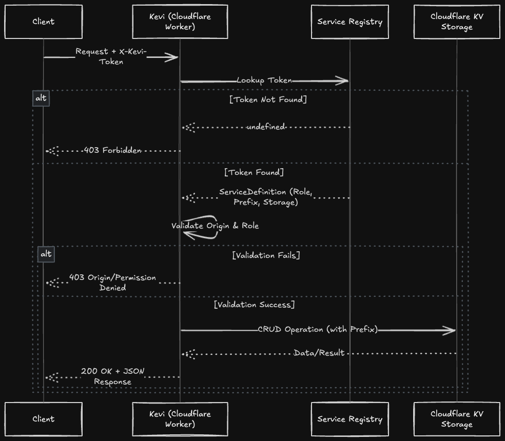

# Kevi 🫆

**Edge-native dynamic configuration store**

Kevi is a high-performance, multi-tenant configuration and metadata store built on Cloudflare Workers and KV. It provides a secure API layer to manage dynamic configurations with built-in role-based access control (RBAC), origin validation, and automatic key prefixing.

## Project Structure

The project follows a modular middleware-based architecture:

- **src/middleware/auth.ts**: Handles RBAC logic and Origin enforcement.
- **src/middleware/init.ts**: Manages global context, service lookup, and CORS.
- **src/routes/kv.ts**: Core CRUD logic for Key-Value operations.
- **src/test/**: Integration tests and environment mocks.
- **src/types/**: Centralized TypeScript interface definitions.
- **src/config.ts**: Service registry where tokens and permissions are defined.
- **src/index.ts**: Application entry point and route orchestration.

## Tech Stack

- **Hono**: Ultrafast web framework for the Edge.
- **Cloudflare Workers**: Serverless compute runtime.
- **Cloudflare KV**: Low-latency distributed key-value storage.
- **Vitest**: Native test runner with Cloudflare Workers pool support.
- **TypeScript**: End-to-end type safety.

## Workflow

The following diagram illustrates the request lifecycle, from token validation to KV interaction:



## Infrastructure Setup

### 1. KV Namespaces

Before deployment, you must create and bind your KV namespaces in `wrangler.jsonc`. Ensure the `binding` names match those used in `src/config.ts`.

```json
"kv_namespaces": [
  {
    "binding": "KEVI_STORAGE",
    "id": "your-kv-namespace-id"
  },
  {
    "binding": "TEST_STORAGE",
    "id": "your-test-kv-id"
  }
]
```

### 2. Global Security Token

Generate a secure global `API_TOKEN` to protect your endpoint. You can generate one using the following command:

```bash
openssl rand -base64 32
```

Add the generated token to the `vars` section of your `wrangler.jsonc`:

```json
"vars": {
  "API_TOKEN": "your-generated-base64-token"
}
```

## Configuration

Service permissions are managed in `src/config.ts.` This allows granular control over which token can access which KV namespace and with what prefix.

```typescript
export const registry: KeviRegistry = {
  "dev-master-admin-321": {
    storage: "TEST_STORAGE",
    role: "admin",
    prefix: "dev",
    description: "Main development key with 'dev:' prefixing.",
    allowedOrigins: ["http://localhost:8787", "http://localhost:3000"],
  },
  "mobile-public-read-999": {
    storage: "KEVI_STORAGE",
    role: "read-only",
    description: "Public read-only access for mobile app.",
  },
};
```

## Getting Started

### Installation

```bash
bun install
```

### Development

```bash
bun run dev
```

### Running Tests

```bash
bun run test
```

### Deploy

```bash
bun run deploy
```

## API Usage

### Set a Configuration

```bash
curl -X POST [https://kevi.your-subdomain.workers.dev/v1/kv/settings](https://kevi.your-subdomain.workers.dev/v1/kv/settings) \
  -H "X-Kevi-Token: your-token" \
  -H "Content-Type: application/json" \
  -d '{"value": {"maintenance": false, "version": "1.0.4"}}'
```

### Get a Configuration

```bash
curl [https://kevi.your-subdomain.workers.dev/v1/kv/settings](https://kevi.your-subdomain.workers.dev/v1/kv/settings) \
  -H "X-Kevi-Token: your-token"
```

## License

This project is licensed under the MIT License - see the [LICENSE](LICENSE) file for details.
