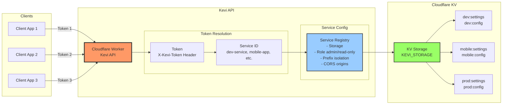
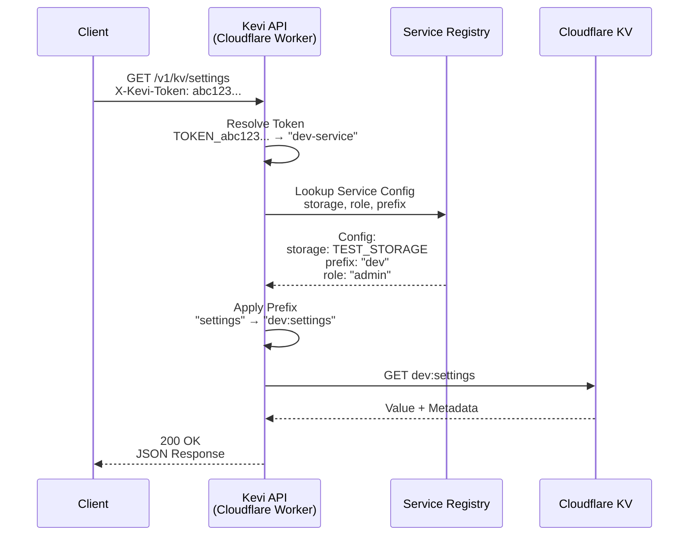

# Kevi Architecture Diagram

Simple visual diagrams explaining what Kevi is and how it works.

## What is Kevi?

Kevi is an **edge-native dynamic configuration store** built on Cloudflare Workers and KV. It provides a secure, multi-tenant API for managing key-value configurations with automatic service isolation.

## Request Flow

How a request flows through Kevi from client to KV storage:

## Key Concepts

- **Token → Service**: Each token maps to a service ID via environment variables
- **Service Isolation**: Keys are prefixed per service (e.g., `dev:settings`, `prod:settings`)
- **Multi-tenant**: Multiple services can share the same KV namespace safely
- **Role-based Access**: Services have `admin` (read/write) or `read-only` roles
- **Edge-native**: Runs on Cloudflare Workers for global low-latency access
