# Kevi Architecture Diagram

This document provides comprehensive Mermaid diagrams visualizing the project structure, request flow, and Cloudflare Workers integration.

## Complete System Architecture

```mermaid
graph TB
    subgraph "Client Layer"
        CLIENT[Client Application]
        ADMIN[Admin Dashboard]
    end

    subgraph "Cloudflare Edge Network"
        CF_WORKER[Cloudflare Worker<br/>Runtime]

        subgraph "Identity Mapping Layer"
            ENV_VARS[Environment Variables<br/>wrangler.jsonc]
            TOKEN_MAP[Token Mapping<br/>TOKEN_* → Service ID]
            API_TOKEN[API_TOKEN<br/>Admin Bypass]
        end

        subgraph "Application Layer"
            APP[Main App<br/>src/index.ts]

            subgraph "Middleware Stack"
                INIT[initApp Middleware<br/>src/middleware/init.ts]
                AUTH[authorize Middleware<br/>src/middleware/auth.ts]
            end

            subgraph "Route Handlers"
                KV_ROUTE[KV Routes<br/>src/routes/kv.ts]
            end
        end

        subgraph "Logic & Policy Layer"
            REGISTRY[Service Registry<br/>src/config.ts]
            SERVICE_DEF[Service Definition<br/>storage, role, prefix,<br/>allowedOrigins, publicKeys]
        end

        subgraph "Utility Layer"
            PUBLIC_KEY[Public Key Utility<br/>src/utils/public-key.ts]
            OPENAPI[OpenAPI Generator<br/>src/utils/openapi.ts]
        end

        subgraph "Storage Layer"
            KV_STORAGE1[KEVI_STORAGE<br/>KV Namespace]
            KV_STORAGE2[TEST_STORAGE<br/>KV Namespace]
        end
    end

    CLIENT -->|X-Kevi-Token Header| CF_WORKER
    ADMIN -->|X-Kevi-Token Header| CF_WORKER

    CF_WORKER --> APP
    APP --> INIT
    INIT --> ENV_VARS
    ENV_VARS --> TOKEN_MAP
    ENV_VARS --> API_TOKEN
    TOKEN_MAP --> REGISTRY
    API_TOKEN --> REGISTRY
    REGISTRY --> SERVICE_DEF
    INIT --> PUBLIC_KEY
    INIT --> AUTH
    AUTH --> KV_ROUTE
    KV_ROUTE --> SERVICE_DEF
    KV_ROUTE --> KV_STORAGE1
    KV_ROUTE --> KV_STORAGE2

    APP --> OPENAPI

    style CF_WORKER fill:#f96,stroke:#333,stroke-width:3px
    style REGISTRY fill:#9cf,stroke:#333,stroke-width:2px
    style KV_STORAGE1 fill:#9f6,stroke:#333,stroke-width:2px
    style KV_STORAGE2 fill:#9f6,stroke:#333,stroke-width:2px
```



## Request Flow Diagram


## Project Structure Diagram


## Security & Authorization Flow

```mermaid
graph TB
    subgraph "Request Arrives"
        REQ[HTTP Request<br/>X-Kevi-Token<br/>Origin Header]
    end

    subgraph "Identity Resolution"
        TOKEN_CHECK{Token in<br/>env.TOKEN_*?}
        ADMIN_CHECK{Matches<br/>API_TOKEN?}
        SERVICE_ID[Service ID Resolved]
    end

    subgraph "Service Lookup"
        REGISTRY_LOOKUP[Lookup in Registry]
        SERVICE_CONFIG[Service Definition<br/>- storage<br/>- role: admin/read-only<br/>- prefix<br/>- allowedOrigins<br/>- publicKeys]
    end

    subgraph "CORS Policy Determination"
        PUBLIC_CHECK{GET Request<br/>&<br/>Public Key?}
        CORS_PUBLIC[CORS: origins: ['*']]
        CORS_SERVICE[CORS: service.allowedOrigins]
    end

    subgraph "Authorization Checks"
        METHOD_CHECK{Request Method?}
        PUBLIC_GET{Public GET?}
        ORIGIN_CHECK{Origin Valid?}
        ROLE_CHECK{Role Check}
    end

    subgraph "KV Operation"
        PREFIX_APPLY[Apply Prefix<br/>prefix:key]
        KV_OP[KV Operation<br/>GET/POST/DELETE]
        RESPONSE[JSON Response]
    end

    REQ --> TOKEN_CHECK
    TOKEN_CHECK -->|Yes| SERVICE_ID
    TOKEN_CHECK -->|No| ADMIN_CHECK
    ADMIN_CHECK -->|Yes| SERVICE_ID
    ADMIN_CHECK -->|No| ERROR_401[401 Unauthorized]

    SERVICE_ID --> REGISTRY_LOOKUP
    REGISTRY_LOOKUP --> SERVICE_CONFIG

    SERVICE_CONFIG --> PUBLIC_CHECK
    PUBLIC_CHECK -->|Yes| CORS_PUBLIC
    PUBLIC_CHECK -->|No| CORS_SERVICE

    CORS_PUBLIC --> METHOD_CHECK
    CORS_SERVICE --> METHOD_CHECK

    METHOD_CHECK -->|GET| PUBLIC_GET
    METHOD_CHECK -->|POST/DELETE| ORIGIN_CHECK

    PUBLIC_GET -->|Yes| PREFIX_APPLY
    PUBLIC_GET -->|No| ORIGIN_CHECK

    ORIGIN_CHECK -->|Valid| ROLE_CHECK
    ORIGIN_CHECK -->|Invalid| ERROR_403_ORIGIN[403 Forbidden<br/>Origin not allowed]

    ROLE_CHECK -->|Admin for Write| PREFIX_APPLY
    ROLE_CHECK -->|Read-only for Write| ERROR_403_ROLE[403 Forbidden<br/>Insufficient permissions]
    ROLE_CHECK -->|Read-only for Read| PREFIX_APPLY

    PREFIX_APPLY --> KV_OP
    KV_OP --> RESPONSE

    style ERROR_401 fill:#f66,stroke:#333,stroke-width:2px
    style ERROR_403_ORIGIN fill:#f66,stroke:#333,stroke-width:2px
    style ERROR_403_ROLE fill:#f66,stroke:#333,stroke-width:2px
    style SERVICE_CONFIG fill:#9cf,stroke:#333,stroke-width:2px
    style KV_OP fill:#9f6,stroke:#333,stroke-width:2px
```

## Cloudflare Workers Integration


## Data Flow: Prefix Isolation

```mermaid
graph TB
    subgraph "Client Request"
        CLIENT_REQ[GET /v1/kv/settings<br/>X-Kevi-Token: abc123...]
    end

    subgraph "Service Resolution"
        TOKEN[Token: abc123...]
        SERVICE_ID[Service ID: dev-service]
        SERVICE_CONFIG[Config:<br/>prefix: 'dev'<br/>storage: 'TEST_STORAGE']
    end

    subgraph "Key Resolution"
        RAW_KEY[Raw Key: 'settings']
        PREFIX_APPLY[Apply Prefix]
        FINAL_KEY[Final Key: 'dev:settings']
    end

    subgraph "KV Storage"
        KV_NAMESPACE[TEST_STORAGE<br/>KV Namespace]
        KV_KEY1[dev:settings<br/>Value: {...}]
        KV_KEY2[dev:config<br/>Value: {...}]
        KV_KEY3[prod:settings<br/>Value: {...}]
    end

    subgraph "Response"
        RESPONSE[JSON Response<br/>data: {...}<br/>metadata: {...}]
    end

    CLIENT_REQ --> TOKEN
    TOKEN --> SERVICE_ID
    SERVICE_ID --> SERVICE_CONFIG
    SERVICE_CONFIG --> RAW_KEY
    RAW_KEY --> PREFIX_APPLY
    PREFIX_APPLY --> FINAL_KEY
    FINAL_KEY --> KV_NAMESPACE
    KV_NAMESPACE --> KV_KEY1
    KV_KEY1 --> RESPONSE

    style FINAL_KEY fill:#9cf,stroke:#333,stroke-width:2px
    style KV_KEY1 fill:#9f6,stroke:#333,stroke-width:2px
    style KV_KEY2 fill:#ccc,stroke:#333,stroke-width:1px,stroke-dasharray: 5 5
    style KV_KEY3 fill:#ccc,stroke:#333,stroke-width:1px,stroke-dasharray: 5 5
```

## Component Interaction Diagram


## Public Key Pattern Matching Flow

```mermaid
graph TB
    subgraph "Configuration"
        CONFIG[Service Config<br/>publicKeys: ['public/*', 'settings']]
    end

    subgraph "Pattern Cache"
        CACHE[Pattern Cache<br/>Key: serviceId]
        EXACT_SET[Exact Matches Set<br/>Set: 'settings']
        WILDCARD_ARRAY[Wildcard Prefixes<br/>Array: ['public/']]
    end

    subgraph "Matching Logic"
        KEY[Input Key: 'public/settings']
        CHECK_EXACT{In Exact Set?}
        CHECK_WILDCARD{Starts with<br/>Wildcard Prefix?}
        RESULT[Match Result]
    end

    CONFIG --> CACHE
    CACHE --> EXACT_SET
    CACHE --> WILDCARD_ARRAY

    KEY --> CHECK_EXACT
    CHECK_EXACT -->|Yes| RESULT
    CHECK_EXACT -->|No| CHECK_WILDCARD
    CHECK_WILDCARD -->|Yes| RESULT
    CHECK_WILDCARD -->|No| RESULT

    RESULT -->|true| PUBLIC_ACCESS[Public Access<br/>CORS: ['*']<br/>Skip Auth]
    RESULT -->|false| PRIVATE_ACCESS[Private Access<br/>CORS: allowedOrigins<br/>Full Auth]

    style CACHE fill:#9cf,stroke:#333,stroke-width:2px
    style RESULT fill:#fc9,stroke:#333,stroke-width:2px
```

These diagrams provide a comprehensive visualization of:

- **System Architecture**: Overall structure and component relationships
- **Request Flow**: Step-by-step request processing
- **Project Structure**: File organization and dependencies
- **Security Flow**: Authentication and authorization logic
- **Cloudflare Integration**: Workers and KV setup
- **Data Flow**: Prefix isolation mechanism
- **Component Interactions**: How modules work together
- **Public Key Matching**: Pattern matching optimization
